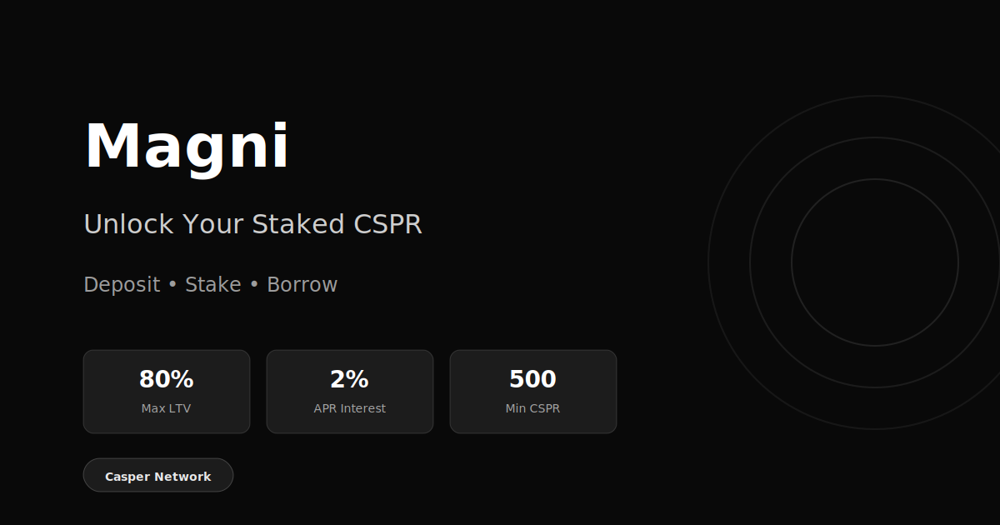

# Magni Protocol

**Unlock your staked CSPR.**

Magni is a collateral-debt vault protocol on Casper Network. Deposit CSPR, earn staking rewards, and borrow against your collateral - all without selling your position.



## 30-Second Pitch

> **Problem:** CSPR holders want to use DeFi without selling their stake.
>
> **Solution:** Magni lets you deposit CSPR (auto-delegated to validators for staking rewards) and borrow mCSPR stablecoin at up to 80% LTV with just 2% APR. When you need your CSPR back, repay and withdraw in two clicks.
>
> **Result:** Keep earning staking rewards while unlocking liquidity.

## Key Features

- **Stake & Borrow**: Deposit CSPR, earn staking rewards, borrow mCSPR
- **80% LTV**: Borrow up to 80% of your collateral value
- **2% APR**: Low-cost borrowing with simple interest
- **2-Step Withdraw**: Respects Casper's unbonding period (~14h testnet / ~14 days mainnet)
- **Demo Mode**: Try the full UX without a wallet
- **Dark/Light Theme**: Your preference, persisted

## Architecture

```
+------------------+       +------------------+       +------------------+
|      User        |       |      Magni       |       |    Validator     |
|   (Casper Wallet)|       |     Contract     |       |    (Staking)     |
+--------+---------+       +--------+---------+       +--------+---------+
         |                          |                          |
         |  1. deposit(CSPR)        |                          |
         |------------------------->|                          |
         |                          |  2. delegate()           |
         |                          |------------------------->|
         |                          |                          |
         |  3. borrow(mCSPR)        |                          |
         |<-------------------------|                          |
         |                          |                          |
         |  4. repay(mCSPR)         |                          |
         |------------------------->|                          |
         |                          |                          |
         |  5. request_withdraw()   |                          |
         |------------------------->|  6. undelegate()         |
         |                          |------------------------->|
         |                          |                          |
         |  7. finalize_withdraw()  |   (after unbonding)      |
         |------------------------->|                          |
         |<-------------------------|                          |
         |       CSPR returned      |                          |
+--------+---------+       +--------+---------+       +--------+---------+
```

---

Magni V2 is a **CSPR vault** on Casper Network:
- Users deposit native CSPR as collateral.
- The protocol delegates pooled collateral to a validator (staking).
- Users can borrow **mCSPR** (debt token) up to **80% LTV**.
- Debt accrues **2% APR** interest.
- Withdrawals are **2-step** due to Casper unbonding: `request_withdraw` -> `finalize_withdraw`.

Leverage looping (e.g. `mCSPR -> swap -> CSPR -> deposit`) is intentionally **out of scope** and should be done externally.

## Repo Structure

```
magni-casper/
  casper/
    magni_casper/     # Odra smart contracts (Rust/WASM)
    frontend/         # React dApp (Vite + TypeScript)
  package.json        # Workspace root (pnpm scripts)
  pnpm-workspace.yaml
```

## Key Parameters

| Parameter | Value |
|-----------|-------|
| LTV (Loan-to-Value) | 80% |
| Interest Rate | 2% APR |
| Min Deposit | 500 CSPR |
| Withdrawal | 2-step (unbonding delay ~14h on testnet) |

## Docs

- Demo steps (copy/paste): `SCENARIO.md`
- Testnet deploy (recommended): `casper/DEPLOY.md`
- Deployed contract history: `casper/CONTRACTS.md`

## Quick Start

### Prerequisites

- Rust nightly (nightly-2025-01-05)
- Odra CLI (`cargo-odra`)
- Node.js + pnpm
- Casper Wallet browser extension (Testnet)

### 1) Install tooling (one-time)

```bash
bash casper/scripts/setup.sh
```

### 2) Deploy contracts to Casper Testnet (recommended)

Follow `casper/DEPLOY.md` for the full flow. In short:

```bash
cp casper/.env.example casper/.env
# Edit casper/.env with your values, then:
set -a && source casper/.env && set +a

bash casper/scripts/testnet_deploy_and_wire_frontend.sh
```

This will also wire the frontend by writing:
- `casper/frontend/.env.local`
- `casper/frontend/src/config/contracts.generated.ts`

### 3) Run the frontend

```bash
pnpm install
pnpm frontend:dev
```

Default URL: `http://127.0.0.1:5173`

## Contracts (high-level)

- `mCSPR`: CEP-18 **standard** debt token (Magni-only mint/burn)
- `Magni (V2)`: vault contract entrypoints used by the dApp:
  - `deposit()` (payable)
  - `borrow(amount_wad)`
  - `repay(amount_wad)` (requires `mCSPR.approve(...)` first)
  - `repay_all()`
  - `request_withdraw(amount_motes)`
  - `finalize_withdraw()`

## Environment Variables

### Contracts (Odra livenet env)

See `casper/.env.example` and `casper/DEPLOY.md`. The deploy script expects:

```
ODRA_CASPER_LIVENET_SECRET_KEY_PATH=/ABS/PATH/to/secret_key.pem
ODRA_CASPER_LIVENET_NODE_ADDRESS=https://node.testnet.casper.network
ODRA_CASPER_LIVENET_EVENTS_URL=https://node.testnet.casper.network/events
ODRA_CASPER_LIVENET_CHAIN_NAME=casper-test

# Optional
DEFAULT_VALIDATOR_PUBLIC_KEY=01...
```

### Frontend (Vite env)

The deploy script auto-writes `casper/frontend/src/config/contracts.generated.ts` with contract hashes.
The app only reads contract hashes from that file (no VITE override).

```
VITE_CASPER_CHAIN_NAME=casper-test
VITE_CASPER_NODE_URL=/rpc
VITE_DEFAULT_VALIDATOR_PUBLIC_KEY=01...
```

## License

ISC
